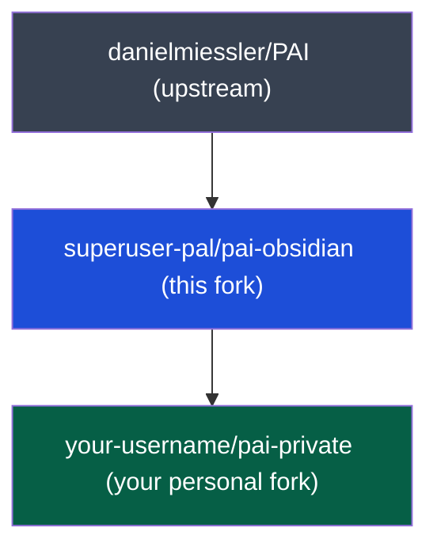

# pai-obsidian

A lean, Obsidian-focused fork of [danielmiessler/Personal_AI_Infrastructure](https://github.com/danielmiessler/Personal_AI_Infrastructure) — pre-configured for knowledge work, thinking, and personal productivity.

---

## Three-tier cascade



| Tier | What it is |
|---|---|
| **PAI upstream** | The full Personal AI Infrastructure — Pulse, DA, Algorithm, 45+ skills |
| **pai-obsidian** | This fork — trimmed to 39 skills for thinking, research, and knowledge work. Adds an Obsidian vault scaffold and 7 vault-native skills (Phase 3) |
| **your private fork** | Fork this repo. Add your identity files, personal API keys, and custom skills here. Never commit personal data to this layer |

---

## Quick start

**Prerequisites:** [Bun](https://bun.sh) · [Git](https://git-scm.com) · [Claude Code](https://claude.ai/code)

```bash
# 1. Fork this repo on GitHub, then clone your fork
git clone https://github.com/<your-username>/pai-obsidian.git
cd pai-obsidian

# 2. Run the installer
bash Releases/v5.0.0/install.sh
```

The installer copies `.claude/` to `~/.claude/` and wires 39 skills into Claude Code.

---

## What's included

39 skills ship by default. Browse [`Packs/`](Packs/) for additional skills you can install manually.

| Group | Skills |
|---|---|
| Thinking | ApertureOscillation, BeCreative, Council, FirstPrinciples, Ideate, IterativeDepth, RedTeam, RootCauseAnalysis, Science, SystemsThinking, WorldThreatModel |
| Research | ExtractWisdom, Fabric, Research, USMetrics |
| Knowledge | ContextSearch, ISA, Knowledge, Telos |
| Creative | Aphorisms, Art, AudioEditor, Sales, WriteStory |
| Dev | Agents, Apify, BitterPillEngineering, Browser, CreateCLI, CreateSkill, Daemon, Delegation, Evals, Interview, Loop, Migrate, Optimize, Prompting, Webdesign |
| Obsidian | *(coming in Phase 3)* |

---

## Staying in sync with upstream

```bash
git fetch upstream
git merge upstream/main
```

---

## License

MIT — see [LICENSE](LICENSE).
